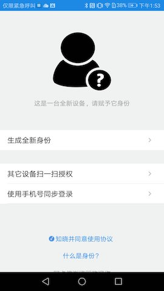
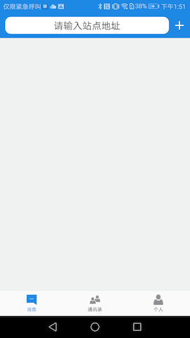
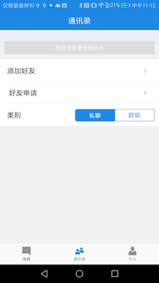
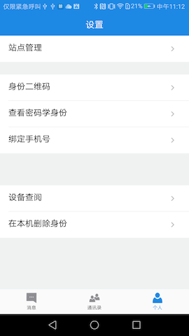
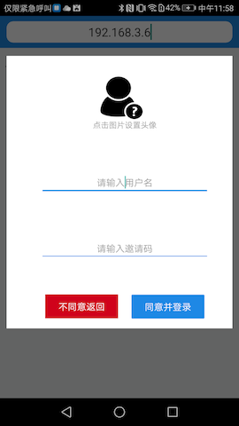
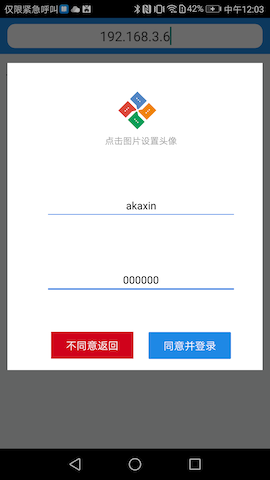
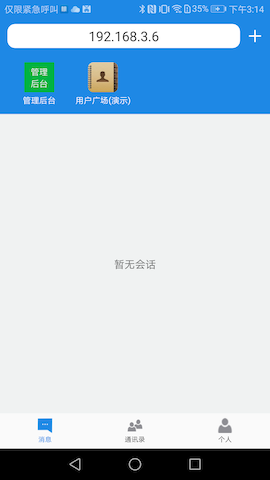
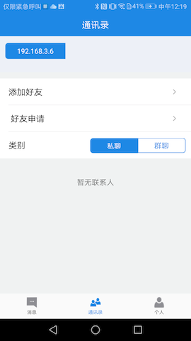
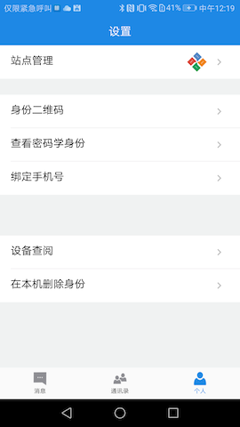

##app访问站点

> 如果你还没有阿卡信app, 请前往官网下载[akaxin](https://www.akaxin.com/)

****
我们第一次打开app，或者删除身份后，重新打开app,界面如下：

###app首页面
* 功能介绍
	* 生成全新身份，会丢弃你以前身份的所有的相关信息，重新生成密钥对
	* 其它设备扫一扫授权，用于多设备之间同步自己的身份信息
	* 手机号同步登录，即使用手机号实名登录站点
	* 

**第一次登录app，我们选择【生成全新身份】，会看到如下图的界面**

* app首页面
	* 【消息帧】即首页，站点地址输入栏以及聊天信息等
	* 【通讯录】你的好友，群组以及好友申请的通知等
	* 【个人】关于你的个人信息，包括身份二维码，站点管理，绑定手机号等
	* 
	* 

****

###app登陆界面
**在站点地址输入栏中，输入自己的站点地址，例如：192.168.3.6，看到如下界面**

* app 登录界面
	* 首次登录的站点管理员，填写用户名，以及邀请码(**邀请码默认000000**)
	* **注意，目前默认首位登录该站点的用户为站点管理员**
	* 

****

###app成功登陆站点
*  
* 

现在，你已经成功的搭建了自己的站点，并且登录了自己的站点。那么接下来，就赶紧将站点地址告诉自己的小伙伴吧，扫描小伙伴的身份二维码添加好友，来打造一个自己的即时通讯平台。
###扩展管理
* [站点管理员如何操作管理后台？](https://github.com/akaxincom/openzaly-admin/blob/master/README.md)
