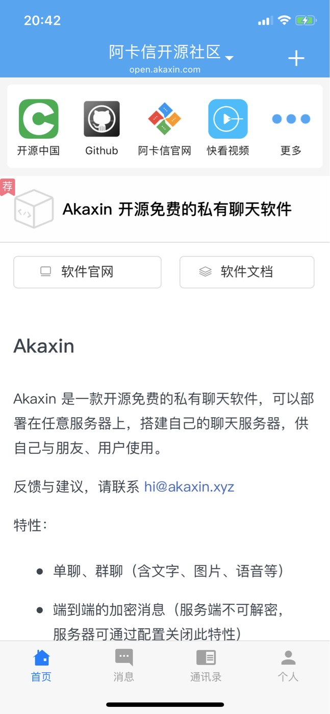
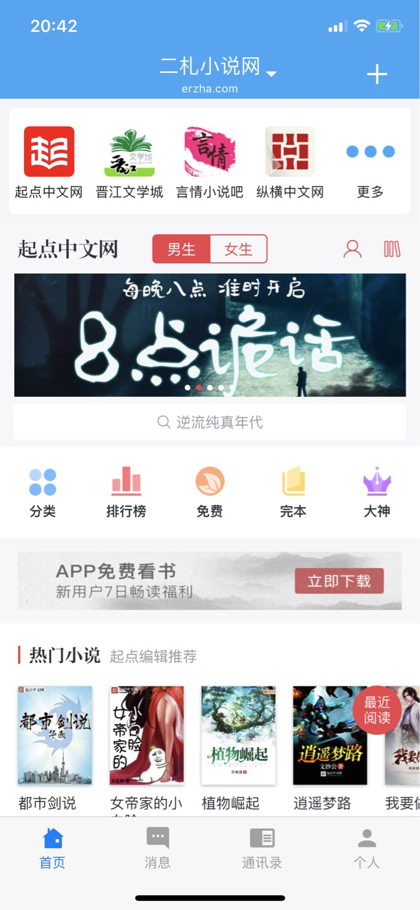

# 带你走进开源阿卡信
------

## 阿卡信介绍
我们理解im在每个APP中存在的价值，也懂得开发一款完善的客户端APP所存在的各种困难，阿卡信的存在就是为了解决这两大问题。

- 让开发一款独立APP更加容易
- 让你想要的APP中存在完整的IM功能

阿卡信是一套体系，它包含一下几个部分：
>* 可定制的通用客户端《阿卡信客户端》
>* 开源的Site服务端《openzaly》
>* 阿卡信扩展小程序
>* 帮助平台《helper-platform》

## 功能介绍
具体的说阿卡信都有哪些功能

1. 通用的im功能
    * 阿卡信帮助你实现一整套完备的即时通讯功能
2. 开源服务端
    * 完全私有服务端数据，并且服务端代码任你改！改！改！
3. 小程序扩展
    * 通过小程序可以定制独一无二的专属功能，并且在客户端首页展示

主要功能:

 * 首页定制
 * 单聊
 * 群聊
 * 文字
 * 图片
 * 语音
 * 绝密聊天
 * 多站点
 * 扫一扫
 * 添加好友
 * 创建群组
 * 站点分享
 * 管理后台

## 场景案例
阿卡信可以使用在各行各业中，可以充当非常强的容器，容纳 | 集成 | 定制：

* 小程序
* 各种WebServer
* 个人博客
* 论坛
* 门户网站
* 行业社区
* 粉丝运营

### 阿卡信打造私人微信
* 问：我想有一个自己的聊天软件，有什么办法吗？
* 答：可以使用阿卡信免费搭建自己聊天服务器，在自己服务器上放心聊，消息安全有保障

### 阿卡信搭建论坛社区
1. 问：我搭建了自己的论坛和社区，可是每次都要分开网页查看很麻烦，怎么办？
2. 答：快使用阿卡信吧，简单几步集成自己的社区，使用方便更简单

### 阿卡信打造小说APP
1. 问：我想开发一款小说APP，可是全栈开发很困难，怎么办？
2. 答：推荐使用阿卡信，通过小程序开发自己想要的业务，阿卡信客户端即刻变成你的APP

## 阿卡信团队
>* [@sisishiliu](https://github.com/sisishiliu)
>* [@SAM2O2O](https://github.com/SAM2O2O)
>* [@childeYin](https://github.com/childeYin)
>* [@Mino0885](https://github.com/Mino0885)
>* [@505541778](https://github.com/505541778)

## 推荐的站点

以下推荐站点，使用二维码 **扫一扫**，即可访问

开源阿卡信社区 open.akaxin.com 这里有阿卡信的最新资讯  
 </img>

二札小说网 erzha.com   

技术新世界 centerbook.org 

畅玩游戏天堂 game.zalyonline.com 

今日优惠 freeticket.today 

#### 联系我们
>- 邮箱：<hi@akaxin.com>
>- QQ群：655249600
